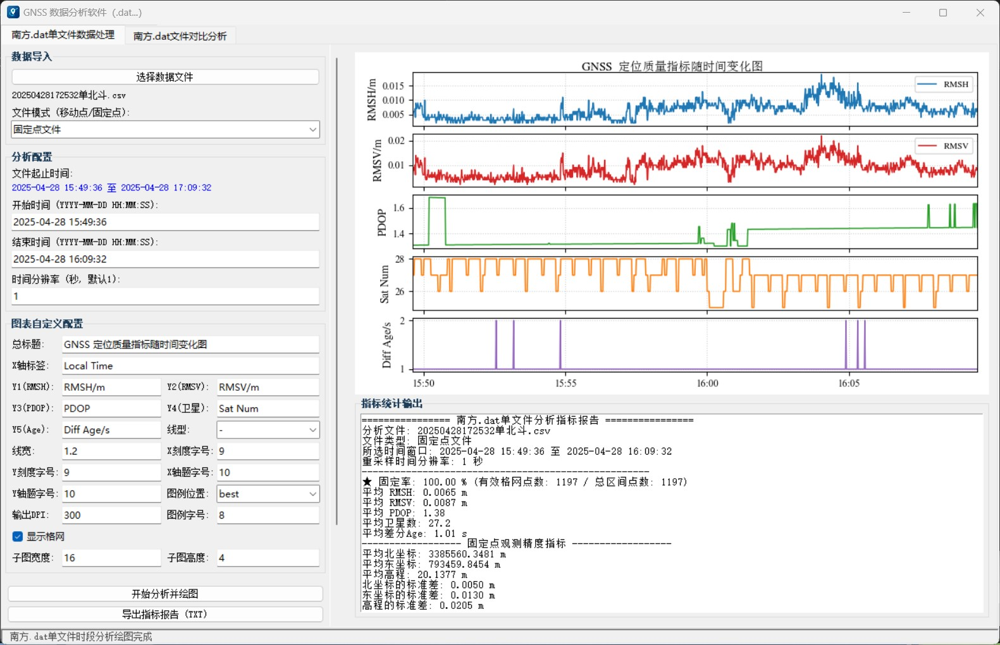

# 
软件说明1.0

本软件基于 Python 开发，用于 GNSS 接收机连续打点、固定点长期观测的数据指标统计与绘图分析，当前适配南方接收机观测数据。

## 1. 数据介绍
原始数据包含字段：点名、北坐标、东坐标、高程、编码、解状态、RMSH、RMSV、卫星数、PDOP、日期、时间、里程、偏距、天线高、实际平滑次数、基站空间距、基站平面距、差分Age、存储类型、存储位置、中桩里程、中桩高程、GPS时间。
程序处理时会自动剔除无用冗余字段。

## 2. 成果输出
### 2.1 统计指标输出
1. 单文件处理
移动点、固定点文件统一输出均值：RMSV、RMSH、卫星数、PDOP、差分Age；
固定点文件额外输出点位平均坐标与坐标标准差。

2. 多文件对比处理
基础统计项与单文件一致，额外输出多组数据对比指标。

### 2.2 绘图输出
自动生成时序曲线：RMSV、RMSH、PDOP、卫星数量、差分Age。

## 3. 单文件处理操作步骤
1. 导入数据：支持 `.dat`、`.csv` 等文本格式，无需手动添加表头，程序内置字段映射；
2. 数据类型选择：区分移动点 / 固定点观测文件，固定点会额外计算坐标均值与标准差；
3. 选定处理时段：所有统计、绘图仅截取所选时间段数据；
4. 设置采样间隔：默认 1s（接收机打点间隔），可根据实际观测频率修改；
5. 图表生成与导出：支持默认样式或自定义绘图参数，分析完成后可导出图片与统计报告；若图表效果不佳，可重置绘图面板，调整参数后重新导出；
6. 切换数据：当前文件分析完毕后，重置程序即可加载下一组观测数据。

## 4. 多文件对比处理操作说明
整体操作流程与单文件处理基本一致，核心差异：
需要分别指定**基准参考文件**与**待对比观测文件**；同样区分移动点/固定点类型，用于差异化指标计算。

## 5.界面示意

